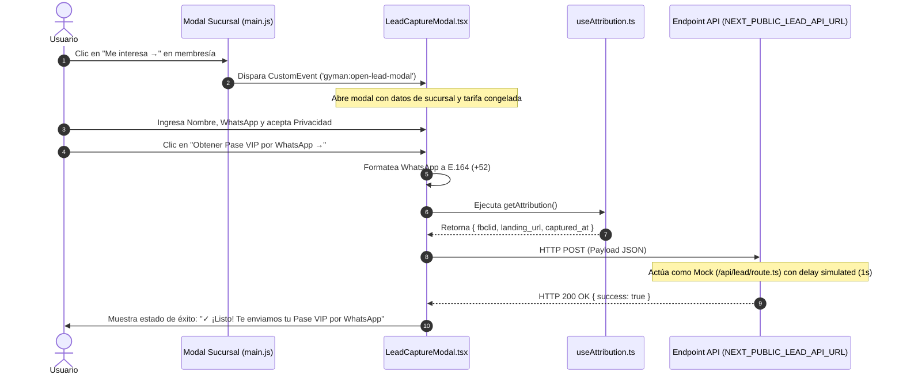

# Walkthrough Técnico — Fase 2: Captura de Leads y Modal Pase VIP

Este documento resume las implementaciones técnicas realizadas en la Landing Page de **GyMan** para la Fase 2, enfocadas en la captura de prospectos (*leads*), atribución publicitaria y preparación para la integración con **Omni AdTech Engine** / **Supabase Edge Functions**.

---

## 1. Resumen de Archivos Creados y Modificados

A continuación se detalla la lista completa de componentes, *hooks*, rutas de API y estilos que fueron agregados o modificados en la arquitectura del proyecto:

* `[NEW]` [LeadCaptureModal.tsx](file:///c:/Users/HANS/OneDrive/Desktop/GyMan%20Landing%20Page/src/components/LeadCaptureModal.tsx)
  * Componente modal interactivo de cliente (`"use client"`). Escucha el evento global `gyman:open-lead-modal`, captura la sucursal e interés de membresía seleccionado, gestiona el estado del formulario, ejecuta las validaciones y realiza la solicitud HTTP `POST` hacia la API de *lead capture*.
* `[NEW]` [useAttribution.ts](file:///c:/Users/HANS/OneDrive/Desktop/GyMan%20Landing%20Page/src/hooks/useAttribution.ts)
  * *Hook* personalizado de React que extrae de forma reactiva el parámetro de atribución de campañas publicitaria de Meta (`fbclid`) desde la URL utilizando `useSearchParams` de Next.js, empaquetando la atribución junto con la URL de origen (`landing_url`) y la marca de tiempo ISO (`captured_at`).
* `[NEW]` [/api/lead/route.ts](file:///c:/Users/HANS/OneDrive/Desktop/GyMan%20Landing%20Page/src/app/api/lead/route.ts)
  * *Route Handler* de Next.js App Router (HTTP `POST`). Funciona actualmente como un **Endpoint Mock de prueba** local que convalida el formato E.164, simula la latencia de procesamiento de red (1 segundo) y responde con un código de estado `200 OK`.
* `[MODIFY]` [globals.css](file:///c:/Users/HANS/OneDrive/Desktop/GyMan%20Landing%20Page/src/app/globals.css)
  * Actualización de la hoja de estilos global. Se incorporaron las animaciones keyframe (`@keyframes slideUp`, `@keyframes spin`) y clases de apoyo (`.lead-modal-overlay`, `.lead-modal-panel`, `.spinner`) para transiciones suaves y *feedback* de carga en la UI.
* `[MODIFY]` [main.js](file:///c:/Users/HANS/OneDrive/Desktop/GyMan%20Landing%20Page/main.js) / [public/legacy/main.js](file:///c:/Users/HANS/OneDrive/Desktop/GyMan%20Landing%20Page/public/legacy/main.js)
  * Script ejecutable del cliente. Se integraron los botones `.lead-cta-btn` ("Me interesa →") dentro del panel desplegable de beneficios de las membresías para emitir el evento personalizado `gyman:open-lead-modal` hacia React.
* `[MODIFY]` [page.tsx](file:///c:/Users/HANS/OneDrive/Desktop/GyMan%20Landing%20Page/src/app/page.tsx)
  * Estructura principal de la landing page. Se montó el componente `<LeadCaptureModal />` encapsulado dentro de `<Suspense fallback={null}>` para garantizar compatibilidad con el renderizado del lado del servidor (SSR) de Next.js al consumir `useSearchParams`.
* `[MODIFY]` [.env](file:///c:/Users/HANS/OneDrive/Desktop/GyMan%20Landing%20Page/.env)
  * Variables de entorno del proyecto. Se incluyó `NEXT_PUBLIC_LEAD_API_URL=/api/lead` para el ruteo dinámico de solicitudes de prospectos.

---

## 2. Diagnóstico del Flujo de Datos del Formulario



### Ruta Detallada del Payload
1. **Disparo del Evento**: Al hacer clic en "Me interesa →" en cualquier tarifa, `main.js` emite `gyman:open-lead-modal` conteniendo `branchName`, `membershipType` y `membershipPrice`.
2. **Procesamiento y Sanitización**:
   * Al presionar **"Obtener Pase VIP por WhatsApp →"**, `LeadCaptureModal.tsx` remueve espacios y caracteres especiales del número de teléfono. Si el número no incluye el prefijo internacional `+`, antepone automáticamente `+52` (formato celular México).
   * Recupera el parámetro `fbclid` de la sesión mediante `useAttribution.ts`.
3. **Estructura del Payload Generado**:
   ```json
   {
     "name": "Juan Pérez",
     "whatsapp": "+525512345678",
     "privacy_consent": true,
     "attribution": {
       "fbclid": "IwAR0AbCdEfGhIjKlMnOpQrStUvWxYz",
       "landing_url": "https://gyman.mx/?fbclid=IwAR0AbCdEfGhIjKlMnOpQrStUvWxYz",
       "captured_at": "2026-07-21T20:20:00.000Z"
     },
     "membership_interest": {
       "branch": "FORTALEZA",
       "type": "Mensualidad VIP",
       "price": "$550"
     }
   }
   ```

### Confirmación del Endpoint Mock (`/api/lead/route.ts`)
* Actualmente, la petición realiza un `fetch` hacia el valor especificado en `process.env.NEXT_PUBLIC_LEAD_API_URL` (cuyo valor por defecto es `/api/lead`).
* `/api/lead/route.ts` es un **Endpoint Mock de prueba** para entorno local. Valida los campos obligatorios, ejecuta la expresión regular E.164 (`/^\+[1-9]\d{6,14}$/`), simula un retraso de procesamiento de 1 segundo (`await new Promise(r => setTimeout(r, 1000))`) y devuelve una respuesta exitosa estática (`status: 200`).

### Configuración para Producción (Omni AdTech Engine / Supabase)
Para conectar la Landing Page con el backend real de producción (**Omni AdTech Engine** o **Supabase Edge Function**), únicamente se requiere ajustar la variable de entorno en `.env` (o en la consola de despliegue de Vercel/Netlify):

```env
# URL de API Real en Producción
NEXT_PUBLIC_LEAD_API_URL=https://<project-ref>.supabase.co/functions/v1/lead-capture
```

No se requieren modificaciones de código en los componentes de frontend, dado que `LeadCaptureModal.tsx` lee la variable de entorno dinámicamente.

---

## 3. Demostración del Estado del Formulario

### Validaciones Técnicas Implementadas
1. **Formato E.164 con Auto-Prefijo `+52`**:
   * Si el usuario escribe `5512345678`, el sistema lo convierte automáticamente a `+525512345678`.
   * Verifica contra la regex `/^\+[1-9]\d{6,14}$/`. En caso de formato inválido, muestra el mensaje: `"Formato de WhatsApp inválido."`.
2. **Checkbox de Privacidad Obligatorio**:
   * Controlado mediante el estado `privacyConsent`. Si el usuario no marca la casilla, se bloquea el envío y muestra: `"Debes aceptar el Aviso de Privacidad."`.
3. **Captura Atribución Meta (`fbclid`)**:
   * Captura el identificador único de clic de Meta en la URL de aterrizaje para posterior atribución de conversión en la API de Conversiones (CAPI) de Meta.

### Copys Exactos del Modal
* **Título Principal**:
  > `¡Conoce GyMan [SUCURSAL] y asegura tu tarifa!`
* **Texto Descriptivo**:
  > `Déjanos tu WhatsApp para enviarte tu Pase VIP de Acceso a [SUCURSAL], conocer las instalaciones sin compromiso y congelar tu precio especial de [TIPO_MEMBRESÍA] para pagar directamente en recepción.`
* **Etiquetas de Inputs**:
  * `NOMBRE COMPLETO` (Placeholder: `Ej. Juan Pérez`)
  * `WHATSAPP` (Placeholder: `+52 55 1234 5678`)
* **Aviso de Privacidad**:
  > `Acepto el Aviso de Privacidad y consiento el tratamiento de mis datos para ser contactado.`
* **Texto de Botón Primario**:
  * Estado Normal: `Obtener Pase VIP por WhatsApp →`
  * Estado Cargando: `Generando tu Pase VIP...`
* **Mensaje de Confirmación (Éxito)**:
  > `✓ ¡Listo! Te enviamos tu Pase VIP por WhatsApp.`

---

## 4. Estado de Compilación

Se ejecutó la verificación de compilación estática y verificación de tipos en el entorno local:

```bash
npm run build
```

### Resultado de Compilación

```text
▲ Next.js 16.2.10 (Turbopack)
- Environments: .env

  Creating an optimized production build ...
✓ Compiled successfully in 14.7s
  Running TypeScript ...
  Finished TypeScript in 9.0s ...
  Collecting page data using 7 workers ...
  Generating static pages using 7 workers (0/6) ...
✓ Generating static pages using 7 workers (6/6) in 2.0s
  Finalizing page optimization ...

Route (app)
┌ ○ /
├ ○ /_not-found
├ ƒ /api/lead
├ ○ /aviso-de-privacidad
└ ○ /solicitud-borrado-datos

○  (Static)   prerendered as static content
ƒ  (Dynamic)  server-rendered on demand
```

> [!NOTE]
> El proyecto compila sin ningún error de TypeScript o sintaxis en los módulos de Next.js / React. El endpoint `/api/lead` se genera correctamente como ruta dinámica `ƒ`.
